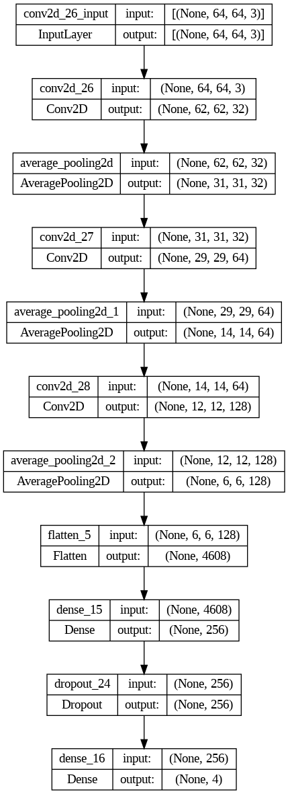
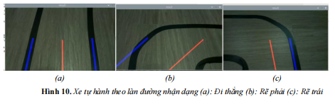

# Autonomous Vehicle
Autonomous Vehicle using Raspberry Pi for recogniting traffic sign, detection lanes , avoidance obstacle.
1. **Recogniting traffic sign:** a convolutional neural network model is used to recognize each type of sign 
   - Images are taken with a phone, through image processing to cut out the part of the image containing the sign, we get the dataset \
       Dataset using for training: [Dataset train](https://drive.google.com/drive/folders/1jVlHyXA7K_qeX94pjMf5qUf6KP4ZWq0y?usp=sharing)\
       Dataset using for testing: [Dataset test](https://drive.google.com/drive/folders/16tBlYple938t9huOVZhQDSjFeU2C3aeC?usp=sharing)
   - Layers used in CNN model:\
     
     \
     The accuracy: 0.94444444\
     Picture predict: \
     
     \
     Using in Camera 5MP Raspberry Pi: \
     
     \
     Link Google training model: [GoogleColab](https://colab.research.google.com/drive/1OtyKf_pCbQxoPxDf8fFXkc2WyGQZsycJ?usp=sharing)
2. **Lane recognition and navigate:** Uses image processing methods supported by OpenCV to obtain two-lane power. The Hough transform is used to extract features from which to find the edges of the lanes in the image and draw virtual lines on these edges as the path the vehicle must take.
   The result of that process is seen through the following image: \
   
   \
   After receiving the information, the raspberry pi will adjust the engine to help the device move in the right lane.
4. **Avoidance obstacle:**: use a distance sensor to measure the distance from the device to the obstacle. Within a pre-set threshold, the device will stop and proceed to move to the right to avoid and then return to the original direction.
5. You can see video demo [here](https://drive.google.com/drive/folders/1HnLDCgJ5IYCvoeBd-MYJ_pAZGwbtllQE?usp=sharing)
     
   
   

